<!-- Combined and cleaned README -->

<div align="center">

```
██╗   ██╗██╗██████╗ ██╗  ██╗ █████╗     ████████╗███████╗ ██████╗██╗  ██╗
██║   ██║██║██╔══██╗██║  ██║██╔══██╗    ╚══██╔══╝██╔════╝██╔════╝██║  ██║
██║   ██║██║██████╔╝███████║███████║       ██║   █████╗  ██║     ███████║
╚██╗ ██╔╝██║██╔══██╗██╔══██║██╔══██║       ██║   ██╔══╝  ██║     ██╔══██║
 ╚████╔╝ ██║██████╔╝██║  ██║██║  ██║       ██║   ███████╗╚██████╗██║  ██║
  ╚═══╝  ╚═╝╚═════╝ ╚═╝  ╚═╝╚═╝  ╚═╝       ╚═╝   ╚══════╝ ╚═════╝╚═╝  ╚═╝
```



<br/>

[](https://bharath-mp-2005.github.io)
[](https://www.linkedin.com/in/bharath-palanisamy-mettukadai-b5000128b/)
[](https://github.com/bharath-mp-2005)


</div>

---

## whoami

```yaml
name        : Bharath Palanisamy Mettukadai
role        : Founder-Engineer
company     : ViBha Tech (Karur, Tamil Nadu)
education   : M.Tech Integrated Data Science — VIT Vellore (SCOPE)
focus       : Fintech SaaS · Behavioral Biometrics · Mobile Apps
published   : ViBha Staff & ViBha Admin — Google Play Store (India)
research    : BB-MAS Behavioral Authentication · IEEE Publication
mission     : "Build things that matter to real people."
```

I don't just write code — I ship products that real people use every day.

---

## Projects

See the curated list of projects and repos below.

- TrustLance — Freelance marketplace · on-chain escrow · IPFS
- BB-MAS Auth — Behavioral biometrics research framework
- Loan Predictor — Loan risk prediction with Streamlit
- EventCraft — Event booking + Razorpay
- ADVT Dashboard — WHO Suicide Stats (R Shiny)
- XO Expense — Shared expense rooms (Supabase)

---

## Tech Stack

See `tech-stack.json` for a machine-readable copy of the stack.

---

## Research

See `research/bbmas.md` for the BB-MAS research notes.

---

## ViBha Tech


ViBha Tech: multi-tenant fintech SaaS for microfinance institutions.

Products:

- ViBha Staff — Flutter app for field loan officers (Play Store)
- ViBha Admin — Branch manager panel (Play Store)
- ViBha Finan — Finance tracking & daybook (in development)
- Core Platform — PHP backend, multi-tenant, OTP auth

---

## Contact

Connect on LinkedIn: https://www.linkedin.com/in/bharath-palanisamy-mettukadai-b5000128b/

---

"Build things that matter to real people." — Bharath Palanisamy Mettukadai

